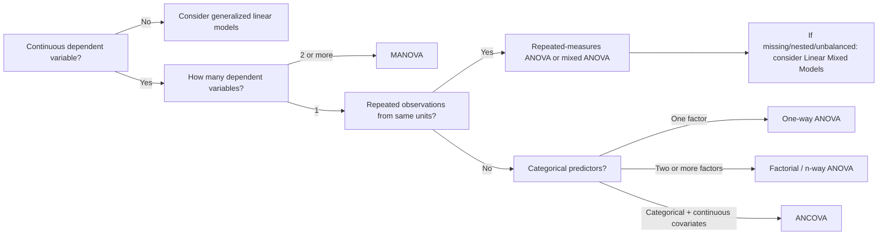

---
{"topic":"Statistics","dg-publish":true,"permalink":"/LearningNotes/ANOVA & Post-hoc Tests/","dgPassFrontmatter":true,"noteIcon":"","dg-note-properties":{"topic":"Statistics"}}
---

# ANOVA
## Core idea

**ANOVA** (*analysis of variance*) tests whether the means of **three or more groups/conditions** differ more than would be expected from within-group variability.

- It is a member of the [[LearningNotes/Regression\|linear model]] family.
- The test statistic follows an [[LearningNotes/F-distribution & F-Test\|F-distribution]] under the null hypothesis.
- Conceptually, ANOVA compares:

$$
F = \frac{\text{variance explained by the model}}{\text{unexplained / residual variance}}
$$

> [!important] Null hypothesis
> Standard ANOVA tests the null hypothesis that all relevant group/condition means are equal. A significant ANOVA tells you that **at least one mean differs**, but not which one. That is why [[LearningNotes/ANOVA & Post-hoc Tests#Post-hoc tests\|#Post-hoc tests]] or planned contrasts are needed.

## Key vocabulary

| Term | Meaning |
|---|---|
| **Factor / independent variable** | A categorical predictor, e.g. treatment group, task condition, genotype. |
| **Level** | A category within a factor, e.g. placebo / drug A / drug B. |
| **Dependent variable** | Continuous outcome being compared across groups/conditions. |
| **Between-subjects factor** | Different participants/items appear in different groups. |
| **Within-subjects factor** | The same participants/items are measured repeatedly across conditions or time. |
| **Main effect** | Effect of one factor averaged over other factors. |
| **Interaction** | Effect of one factor depends on the level of another factor. |
| **Covariate** | Continuous variable adjusted for in ANCOVA, e.g. age, baseline score. |

## Choosing the right ANOVA-family method

| Use when                                                                       | Typical method                      | Example                                                              | Note                                                                                                                                                                                                                                                                                    |
| ------------------------------------------------------------------------------ | ----------------------------------- | -------------------------------------------------------------------- | --------------------------------------------------------------------------------------------------------------------------------------------------------------------------------------------------------------------------------------------------------------------------------------- |
| One categorical independent variable; independent groups                       | **One-way ANOVA**                   | Compare exam scores across 3 teaching methods.                       |                                                                                                                                                                                                                                                                                         |
| Two or more categorical independent variables; independent groups              | **Factorial / n-way ANOVA**         | Compare effects of teaching method × school type.                    | Interactions are often more important than main effects                                                                                                                                                                                                                                 |
| Same subjects/items measured in 3+ conditions or time points                   | **Repeated-measures ANOVA**         | Compare reaction time at baseline, week 1, week 4.                   | - Assumed **sphericity** : variances of the differences between all pairs of repeated conditions are equal - Tested using **Mauchly's test of sphericity** - If violated, use corrections such as **Greenhouse–Geisser** or **Huynh–Feldt**, or consider [[LearningNotes/Linear Mixed Models\|Linear mixed models]]. |
| Both between-subjects and within-subjects factors                              | **Mixed ANOVA**                     | Drug vs placebo groups measured across 4 time points.                |                                                                                                                                                                                                                                                                                         |
| Categorical factor(s) plus continuous covariate(s)                             | **ANCOVA (Analysis of Covariance)** | Compare treatment groups while adjusting for baseline score.         |                                                                                                                                                                                                                                                                                         |
| Multiple correlated dependent variables                                        | **MANOVA (Multivariate ANOVA)**     | Compare groups on anxiety, depression, and stress scores together.   | Common multivariate test statistics: - **Pillai's trace** — often the most robust; - **Wilks' lambda**; - **Hotelling's trace**; - **Roy's largest root**.                                                                                                                  |
| Repeated measures with missing/unbalanced data, nested data, or random effects | [[LearningNotes/Linear Mixed Models\|Linear mixed models]]             | Trials nested within participants; participants nested within sites. |                                                                                                                                                                                                                                                                                         |

> [!tip] Practical rule
> If your design is unbalanced, hierarchical, has missing repeated measurements, or has subject/item-level random effects, a [[LearningNotes/Linear Mixed Models\|linear mixed model]] is often more flexible than classical ANOVA.

## ANCOVA

**ANCOVA** (*analysis of covariance*) combines ANOVA and [[LearningNotes/Regression\|linear regression]]. It compares group means while statistically adjusting for one or more continuous covariates.

Example question: *Do treatment groups differ in final exam score after adjusting for baseline score?*

Model idea:

$$
Y = \beta_0 + \beta_1\text{Group} + \beta_2\text{Covariate} + \epsilon
$$

Use ANCOVA when:

- the outcome is continuous;
- the main predictor is categorical;
- there are continuous covariates that may explain outcome variability;
- you want adjusted group means.

Additional assumptions:

- the covariate is linearly related to the dependent variable;
- the covariate is measured reliably;
- **homogeneity of regression slopes**: the relationship between covariate and outcome is similar across groups;
- the covariate should not be affected by the treatment if the goal is causal interpretation.

> [!warning]
> Do not blindly use ANCOVA to “control for” variables measured after the treatment/intervention. Adjusting for post-treatment variables can bias causal interpretation.

## MANOVA

**MANOVA** (*multivariate analysis of variance*) extends ANOVA to **multiple dependent variables** considered jointly.

Example question: *Do treatment groups differ on a combined profile of anxiety, depression, and stress scores?*

Use MANOVA when:

- there are 2+ correlated continuous dependent variables;
- the independent variable(s) are categorical;
- you care about group differences in a multivariate outcome pattern.

Common multivariate test statistics:

- **Pillai's trace** — often the most robust;
- **Wilks' lambda**;
- **Hotelling's trace**;
- **Roy's largest root**.

If MANOVA is significant, follow up with:

1. univariate ANOVAs for each dependent variable;
2. corrected post-hoc tests or planned contrasts;
3. effect sizes and confidence intervals.

> [!note]
> MANOVA is not simply “many ANOVAs.” It accounts for correlations among dependent variables and tests whether groups differ on the combined multivariate outcome.

## Assumptions and diagnostics

| Assumption                                        | Applies to                          | How to check / handle                                                         |     |
| ------------------------------------------------- | ----------------------------------- | ----------------------------------------------------------------------------- | --- |
| Independent observations                          | Most between-subjects ANOVA designs | Study design; avoid treating repeated/nested observations as independent.     |     |
| Continuous dependent variable                     | ANOVA, ANCOVA, MANOVA               | Check measurement scale and distribution.                                     |     |
| Approximate normality of residuals                | ANOVA-family models                 | Residual Q-Q plots; [[LearningNotes/Normality Tests\|Normality Tests]] such as Shapiro–Wilk.                 |     |
| Homogeneity of variances                          | Between-subjects ANOVA              | [[LearningNotes/Test for Equality of Variances#^748562\|Test for Equality of Variances#^748562]]                                    |     |
| Sphericity                                        | Repeated-measures ANOVA             | Mauchly's test; Greenhouse–Geisser / Huynh–Feldt corrections.                 |     |
| Homogeneity of regression slopes                  | ANCOVA                              | Test group × covariate interaction.                                           |     |
| Multivariate normality and covariance homogeneity | MANOVA                              | Inspect outliers; Box's M test cautiously; use robust alternatives if needed. |     |

> [!important] Balanced vs unbalanced designs
> Equal group sizes are **helpful but not strictly required** for ANOVA. Classical ANOVA is more robust and easier to interpret with balanced groups. With unequal group sizes, be careful about variance heterogeneity and sums-of-squares type, especially in factorial ANOVA.

# Post-hoc tests

A **post-hoc test** is used after a significant omnibus ANOVA when you need to identify **which groups or conditions differ**.

Common options:

| Test | Best used when | Notes |
|---|---|---|
| **Tukey's HSD** | All pairwise comparisons among group means | Good default for equal or near-equal sample sizes. |
| **Games–Howell** | Pairwise comparisons with unequal variances or unequal sample sizes | Does not assume equal variances. |
| **Bonferroni correction** | Small number of planned or post-hoc comparisons | Simple but conservative. See [[LearningNotes/Adjusting p-values in Statistical analysis\|Adjusting p-values in Statistical analysis]]. |
| **Holm correction** | Multiple comparisons | Usually more powerful than Bonferroni. |
| **Dunnett's test** | Compare several treatments against one control | Avoids unnecessary all-pair comparisons. |
| **Scheffé test** | Complex or exploratory contrasts | Very conservative. |

## Tukey's HSD

**Tukey's Honestly Significant Difference (HSD)** compares all pairs of group means while controlling the family-wise error rate.

Use when:

- the omnibus ANOVA is significant;
- you want all pairwise group comparisons;
- group variances are approximately equal.

Avoid or replace with Games–Howell when:

- variances are strongly unequal;
- group sizes are very unequal.

# Effect sizes

Report effect sizes alongside p-values.

| Effect size | Use |
|---|---|
| $\eta^2$ (*eta squared*) | Proportion of total variance explained by an effect. |
| Partial $\eta^2$ | Common in factorial and repeated-measures ANOVA; effect variance relative to effect + error variance. |
| $\omega^2$ (*omega squared*) | Less biased estimate of population effect size than $\eta^2$. |
| Cohen's $d$ | Pairwise group differences; often used for post-hoc contrasts. |

# Reporting checklist

When reporting ANOVA-family results, include:

- design and factors, including levels;
- sample size per group/condition;
- whether factors are between-subjects or within-subjects;
- assumption checks and any corrections used;
- test statistic, degrees of freedom, p-value;
- effect size and confidence interval where possible;
- post-hoc method and adjusted p-values;
- interpretation in plain language.

Example format:

> A one-way ANOVA showed a significant effect of teaching method on test score, $F(2, 57) = 5.42$, $p = .007$, $\eta^2 = .16$. Tukey post-hoc tests indicated that Method A produced higher scores than Method C, while other pairwise differences were not significant.

# Quick decision guide

