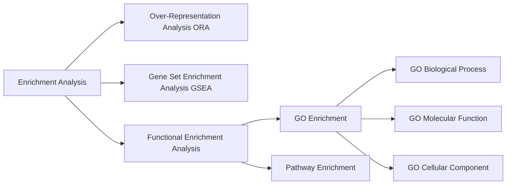

---
{"topic":"AIxHealth","dg-publish":true,"status":"draft","permalink":"/LearningNotes/Enrichment Analysis/","dgPassFrontmatter":true,"noteIcon":"","dg-note-properties":{"topic":"AIxHealth","status":"draft"}}
---

# Basics
Enrichment analysis = to analyze whether specific biological pathways or functions are over-represented (enriched) in large-scale [[LearningNotes/Omics Data Analysis\|omics data]], e.g. genes or proteins.
## Core idea
- input: a gene/protein list, or a ranked gene/protein list
- question: whether some biological pathways, functions, or gene groups appear more than expected
- output: enriched pathways/functions/gene sets for interpretation

> [!Note] Important idea
> Enrichment analysis is usually not about one gene. It is about whether a **group of genes** points to a biological function, pathway, or process.

## Key terms
**Foreground**
= the selected/presented genes or proteins

**Background**
= the genes/proteins existing in the whole genome, or the reference set used for comparison

> [!Warning]
> Background choice matters. A bad background can make the enrichment result misleading. It should match the experiment, not always the whole genome.

**Gene set**
= a predefined group of genes that share something, e.g. same pathway, same biological function, same cellular location, or same regulation pattern

**Ranked gene list**
= genes ordered by a score, e.g. [[LearningNotes/Omics Data Analysis#Differential analysis\|fold change]], test statistic, correlation, or other measurement

**Enriched**
= a gene set/pathway/function appears more strongly than expected by chance

**Enrichment scores**
= a number that summarizes how strongly a gene/protein set is enriched in the input data.
It is often based on:
- overlap between a selected list and a gene set
- position of gene set members in a ranked list
- statistical evidence that the observed pattern is unlikely by chance, related to [[LearningNotes/Stats Cheatsheet#P-value\|p-value]] reasoning

> [!Tip]
> Different methods calculate enrichment scores differently. So the score should be interpreted together with the method/tool that produced it. See below.


# Main Types
## Overview and Comparison



| Method             | Input                                    | Main question                                                               | When to use                                      | Gene set presented                        |
| ------------------ | ---------------------------------------- | --------------------------------------------------------------------------- | ------------------------------------------------ | ----------------------------------------- |
| ORA                | selected foreground + background         | is this gene set over-represented in the selected genes?                    | when there is a clear selected gene/protein list | any predefined gene set                   |
| GSEA               | ranked gene list                         | are genes from this gene set concentrated at the top/bottom of the ranking? | when cutoff for selecting genes is unclear       | any predefined gene set                   |
| GO enrichment      | gene list/ranked list + GO database      | enrichment (by ORA or GSEA) using GO terms                                  | [[LearningNotes/Omics Data Analysis#Functional Interpretation\|functional interpretation]] | functions/processes/locations             |
| Pathway enrichment | gene list/ranked list + pathway database | enrichment (by ORA or GSEA) using pathway gene sets                         | pathway interpretation                           | biological pathways or interaction routes |

## Over-Representation Analysis (ORA)
= tests whether a gene set is over-represented in a selected foreground list compared with a background list
### How it works
- start with a foreground gene list, e.g. differentially expressed genes from [[LearningNotes/Omics Data Analysis#Differential analysis\|differential analysis]]
- choose a background gene set, e.g. all measured genes
- check each pathway/function/gene set
- ask: does this gene set contain more foreground genes than expected?
#### Input
- foreground gene list
- background gene list
- gene set database
#### Output
- gene sets/pathways/functions with enrichment scores or p-values
#### Enrichment scores & stats
In ORA, the score/statistics are based on **overlap** between:
- foreground genes
- background genes
- genes inside one gene set/pathway/function

Notation:
- $N$ = total number of background genes
- $n$ = number of selected foreground genes
- $K$ = number of genes in the gene set, within the background
- $k$ = observed overlap between the foreground and the gene set

Contingency table (related idea: [[LearningNotes/Chi-square Test#Applications\|contingency table tests]]):

| | In gene set | Not in gene set | Total |
| --- | --- | --- | --- |
| Foreground | $k$ | $n-k$ | $n$ |
| Not foreground | $K-k$ | $N-K-n+k$ | $N-n$ |
| Background total | $K$ | $N-K$ | $N$ |

##### Gene ratio
= proportion of foreground genes in the gene set
```text
gene ratio = k / n
```
##### Background ratio
= proportion of background genes in the gene set
```text
background ratio = K / N
```
##### Fold enrichment
= how much more common the gene set is in the foreground than in the background.
```text
fold enrichment = gene ratio / background ratio
                = (k / n) / (K / N)
```
Meaning:
- fold enrichment > 1: gene set is more common in the foreground than expected
- fold enrichment = 1: gene set appears at the expected background rate
- fold enrichment < 1: gene set is less common in the foreground than expected
##### P-value
P-value comes from a **random sampling model** with tests:
- hypergeometric test, a discrete probability model related to [[LearningNotes/Random Variables & Probability distributions\|Random Variables & Probability distributions]]
- Fisher's exact test
Hypergeometric probability:

```text
P(X = k) = [C(K, k) * C(N-K, n-k)] / C(N, n)
```

For enrichment, the p-value is usually:

```text
p-value = P(X >= observed k)
```

Meaning:
- small p-value: this much overlap would be unlikely by random sampling
- large p-value: this overlap could easily happen by random sampling

##### Adjusted p-value / FDR
ORA tests many gene sets at once, so tools correct p-values for multiple testing. Adjusted p-value / FDR provides corrected significance after considering that many gene sets were tested. See [[LearningNotes/Adjusting p-values in Statistical analysis\|Adjusting p-values in Statistical analysis]].

## Gene Set Enrichment Analysis (GSEA)
= tests whether genes from a gene set tend to appear near the top or bottom of a ranked gene list.
### How it works
- start with all genes ranked by a score
- do not need to first cut genes into significant/non-significant groups
- for each gene set, check whether its genes are concentrated at one end of the ranked list
#### Input
- ranked gene list
- gene set database
#### Output
- gene sets enriched near the top or bottom of the ranking

#### Enrichment scores & stats
In GSEA, the score/statistics are based on **where gene set members appear in a ranked gene list**.

##### GSEA Enrichment Score
GSEA walks down the ranked list:
- if the gene is in the gene set: running score goes up
- if the gene is not in the gene set: running score goes down

Simplified unweighted idea:
- genes inside the gene set add positive weight
- genes outside the gene set add negative weight
- the running score starts at 0 and ends at 0

The enrichment score is the largest deviation from zero.

```text
Enrichment Score = maximum running-score deviation from 0
```

Meaning:
- positive ES: gene set is concentrated near the top of the ranking
- negative ES: gene set is concentrated near the bottom of the ranking
- ES near 0: gene set is spread more randomly across the ranking

> [!Note]
> In real GSEA, the increase can be weighted by the ranking score, so highly ranked genes may contribute more strongly.
##### NES
= normalized enrichment score.

Why normalize:
- different gene sets have different sizes
- raw ES values are not always directly comparable

So GSEA often normalizes ES to make gene sets more comparable.

##### P-value
GSEA p-value usually comes from **permutation/randomization**, which is also a sampling/randomization idea (see [[LearningNotes/Data Sampling\|Data Sampling]]).

Simplified idea:
- calculate the real ES
- shuffle gene labels or rankings many times
- calculate ES again for each random version
- ask how often a random ES is as strong as the real ES
- p-value = fraction of random/permuted results with ES as strong as observed ES

## Functional enrichment analysis
= general name for enrichment analysis that interprets a gene/protein list by biological functions.
- Analyzes whether certain biological functions, pathways, or gene sets are statistically over-represented (enriched) in a list of genes/proteins/metabolites of interest.
- how it works
	1. take a list of significant genes or proteins
	2. compare them to known biological pathways or function sets
	3. statistically test whether any functions or pathways appear more often than expected
### GO enrichment
= enrichment analysis using Gene Ontology terms as the gene sets. It is not a different statistical idea by itself - it means the enrichment result is interpreted through **GO terms**.

>[!Tip] Gene Ontology (GO) = a structured vocabulary for describing gene functions.
>
#### Main GO categories

| GO category                | Meaning                                                   |
| -------------------------- | --------------------------------------------------------- |
| GO Biological Process (BP) | biological programs/processes, e.g. cell cycle            |
| GO Molecular Function (MF) | molecular activity, e.g. binding or enzyme activity       |
| GO Cellular Component (CC) | where gene products are located, e.g. nucleus or membrane |

#### How it works
- use GO terms as predefined gene sets
- run [[LearningNotes/Enrichment Analysis#Over-Representation Analysis (ORA)\|ORA]] or [[LearningNotes/Enrichment Analysis#Gene Set Enrichment Analysis (GSEA)\|GSEA]]-like analysis
- output enriched GO terms
### Pathway enrichment
= enrichment analysis using pathway databases as gene sets.

Examples of pathway-style interpretation
- signaling pathways
- metabolic pathways
- disease-related pathways

# Common workflow
1. get gene/protein measurements from omics data
2. for protein, usually first map proteins to gene IDs / annotations; see [[LearningNotes/Proteomics Analysis and Modeling\|Proteomics Analysis and Modeling]]
3. define input
	- ORA: foreground + background
	- GSEA: ranked gene list
4. choose gene sets/database
	- GO terms
	- pathways
	- other curated gene sets
5. run enrichment test
6. correct for multiple testing ([[LearningNotes/Adjusting p-values in Statistical analysis\|Adjusting p-values in Statistical analysis]])
7. interpret enriched terms carefully

## Things to be careful about
- gene identifiers need to match the database; for proteins, check platform/protein identifiers in [[LearningNotes/Proteomics Analysis and Modeling#What proteomics data looks like\|Proteomics Analysis and Modeling#What proteomics data looks like]]
- enrichment does not prove causality
- similar GO terms can be redundant
- large gene sets may be easier to detect but less specific
- small gene sets may be specific but unstable
- multiple testing correction is needed because many gene sets are tested ([[LearningNotes/Adjusting p-values in Statistical analysis\|Adjusting p-values in Statistical analysis]])


