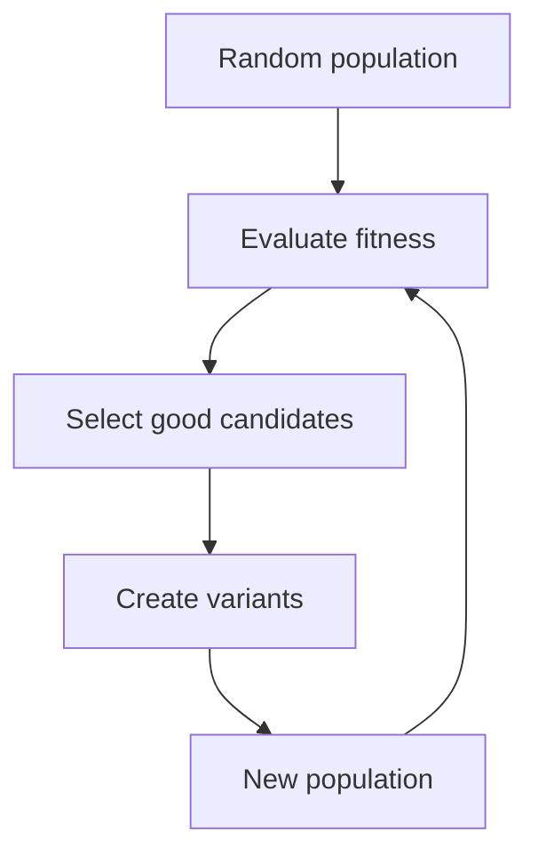

---
{"topic":"MachineLearning, Modeling, Math","dg-publish":true,"permalink":"/LearningNotes/Evolutionary Algorithms/","dgPassFrontmatter":true,"noteIcon":"","dg-note-properties":{"topic":"MachineLearning, Modeling, Math"}}
---

> [!Summary] 
> Evolutionary algorithms are **population-based search algorithms**.
> They do not improve one solution step-by-step like [[LearningNotes/Gradient Descent\|Gradient Descent]]. Instead, they keep many candidate solutions, let the better ones “survive”, and create new variants until a good solution appears.
# Overview
## Definition
Evolutionary algorithms (EA) are optimization methods inspired by biological evolution.

The basic idea is simple:
- generate many possible solutions
- score each solution by a **fitness function**
- keep the better solutions
- make small random changes or recombinations
- repeat the process over many generations

> [!Intuition]
> Imagine trying to design a good recipe without knowing the formula. You cook many versions, taste them, keep the better ones, mix ideas from them, add small experiments, and repeat. Evolutionary algorithms do this for optimization problems.

## Key concepts
- **Individual / candidate solution**
	- one possible answer to the problem
	- e.g. one set of model hyperparameters, one route, one neural network architecture
- **Population**
	- a group of candidate solutions searched at the same time
- **Gene / chromosome / genome**
	- the representation of a solution
	- e.g. a binary string, vector of real numbers, tree-shaped program, or list of choices
- **Fitness function**
	- a scoring rule that tells us how good a solution is
	- e.g. accuracy, profit, negative loss, shortest distance
- **Selection**
	- choose better solutions to become “parents”
- **Crossover / recombination**
	- combine parts of two or more parents
- **Mutation**
	- randomly change a small part of a solution
- **Generation**
	- one round of evaluate → select → create new population

## General workflow
1. **Initialize** a population randomly.
2. **Evaluate** every candidate using the fitness function.
3. **Select** better candidates as parents.
4. **Create offspring** using crossover and/or mutation.
5. **Replace** some old candidates with new ones.
6. Repeat until:
	- maximum generations reached
	- fitness stops improving
	- a good enough solution is found

### Common hyperparameters
- population size
- mutation rate
- crossover rate
- number of generations
- selection pressure
- elitism size
- stopping criteria
- fitness function design
## Why use evolutionary algorithms
Evolutionary algorithms are useful when:
- the search space is large and messy
- the objective function is *non-differentiable*
- gradients are unavailable or unreliable
- there are many local optima
- the solution is discrete, symbolic, or structured
- evaluating a solution is easy, but designing the solution manually is hard

>[!Tip] Compared with [[LearningNotes/Gradient Descent\|Gradient Descent]]
>- gradient descent asks: “which direction should I move from here?”
>- evolutionary algorithms ask: “among many attempts, which ones should reproduce?”

## Pros & Cons
### Pros
- does not require gradients
- works with discrete, continuous, and mixed search spaces
- can optimize black-box functions
- naturally parallelizable
- good for global search and messy objectives
- can handle multiple objectives

### Cons
- often computationally expensive
- may need many fitness evaluations
- no guarantee of finding the global optimum
- performance depends heavily on representation and hyperparameters
- can converge too early if diversity is lost

## Exploration vs. Exploitation Trade-off
Evolutionary algorithms need a balance:
- **exploration**: try very different solutions
- **exploitation**: refine already good solutions

Mutation increases exploration.
Selection increases exploitation.
Crossover can do both, depending on how it is used.

> [!Important]
> Too much exploration = random wandering.  
> Too much exploitation = premature convergence to a mediocre solution.
# Main methods
## Genetic Algorithm (GA)
Genetic algorithm is the most classic evolutionary algorithm.

It usually represents each solution as a chromosome, then uses selection, crossover, and mutation to evolve better chromosomes.
### Easy intuition
GA is like breeding solutions. Good solutions are more likely to become parents, crossover mixes their useful parts, and mutation keeps the search from becoming too narrow.
### How it works
1. Encode each possible solution as a chromosome.
	- e.g. `101101`, or `[learning_rate, max_depth, dropout]`
2. Generate a population of random chromosomes.
3. Evaluate the fitness of each chromosome.
4. Select high-fitness chromosomes as parents.
5. Use **crossover** to exchange parts between parents.
	- like taking the first half from parent A and the second half from parent B
6. Use **mutation** to randomly change some genes.
	- like flipping a bit or slightly changing a number
7. The offspring form the next generation.
8. Repeat until the population becomes good enough.

## Evolution Strategy (ES)
Evolution strategy is often used for optimizing continuous numbers.
Instead of focusing on crossover, ES usually relies heavily on mutation and selection.
### Easy intuition
ES is like standing in a foggy landscape and throwing many small stones around you. If some stones land at better places, you move toward those places and throw again.
### How it works
1. Start with a vector of real-valued parameters.
	- e.g. $x = [1.2, -0.7, 3.4]$
2. Create many mutated copies by adding random noise.
	- e.g. $x' = x + \epsilon$
3. Evaluate all copies.
4. Keep the best copies.
5. Use them as the center for the next round of mutations.
6. Repeat with gradually better parameter vectors.

## Genetic Programming (GP)
Genetic programming evolves **programs**, not just numbers.
The solution is often represented as a tree, where nodes are operations and leaves are inputs/constants.
### Easy intuition
GP is like automatically trying many little pieces of code. Useful code fragments are copied, recombined, and modified until the algorithm discovers a program that works.
### How it works
1. Generate many random programs.
	- e.g. formulas like `x + 2`, `sin(x) * y`, or decision rules
2. Run each program and measure its fitness.
3. Select better programs.
4. Use crossover by swapping subtrees between two programs.
5. Use mutation by changing an operator, variable, or subtree.
6. Repeat until a useful program or formula emerges.

## Differential Evolution (DE)
Differential evolution is a simple and strong method for continuous optimization.
It creates new candidate vectors by looking at the **difference between existing candidates**.
### Easy intuition
DE asks: “how are two existing solutions different?” Then it uses that difference as a direction for trying a new solution. It learns useful step sizes from the population itself.
### How it works
1. Keep a population of vectors.
2. For each vector, pick three other vectors: $a$, $b$, and $c$.
3. Create a trial vector:
	$$v = a + F(b - c)$$
	where $F$ controls the mutation size.
4. Mix the trial vector with the original vector.
5. Evaluate both.
6. Keep whichever has better fitness.
## Covariance Matrix Adaptation Evolution Strategy (CMA-ES)
CMA-ES is an advanced evolution strategy for continuous optimization. It learns not only where good solutions are, but also the shape and direction of the promising search region.
### Easy intuition
CMA-ES is like searching with a spotlight. At first the spotlight is round and wide. As it learns where good solutions tend to be, it reshapes the spotlight into an ellipse pointing in the right direction.
### How it works
1. Start with a center point and a search distribution.
2. Sample many candidate solutions around the center.
3. Evaluate their fitness.
4. Move the center toward the better candidates.
5. Update the covariance matrix.
	- this tells the algorithm which directions are promising
	- it can stretch the search distribution along useful directions
6. Repeat until convergence.

## NSGA-II
NSGA-II is an evolutionary algorithm for **multi-objective optimization**.

It is used when there is more than one goal and the goals conflict.

Examples:
- maximize accuracy but minimize model size
- maximize profit but minimize risk
- minimize cost but maximize quality
### Easy intuition
NSGA-II does not search for one “best” answer. It searches for a menu of good trade-offs, like “cheap but lower quality”, “expensive but high quality”, and several options in between.
### How it works
1. Generate a population of candidate solutions.
2. Evaluate each solution on multiple objectives.
3. Sort solutions by **Pareto dominance**.
	- a solution is better if it improves one objective without worsening another
4. Keep a diverse set of good trade-off solutions.
5. Use crossover and mutation to create the next generation.
6. Repeat to approximate the Pareto frontier.
## Neuroevolution
Neuroevolution uses evolutionary algorithms to design or train neural networks.

It can evolve:
- neural network weights
- architectures
- activation functions
- hyperparameters
- learning rules
### Easy intuition
Instead of using backpropagation to adjust one network, neuroevolution creates many networks, tests them, and lets the better designs survive.
### How it works
1. Represent each neural network as a genome.
2. Create a population of different networks.
3. Evaluate each network on a task.
4. Select networks with better performance.
5. Mutate or recombine their weights/structures.
6. Repeat until a better network is found.

# Selection methods
## Fitness-proportionate selection
Also called **roulette wheel selection**.
### Easy intuition
Better solutions get more lottery tickets, but weaker solutions can still occasionally be selected.
### How it works
- each candidate gets a probability proportional to its fitness
- higher fitness means a larger slice of the wheel
- spin the wheel to select parents

## Tournament selection
### Easy intuition
Instead of ranking everyone globally, the algorithm runs many mini-competitions.
### How it works
1. Randomly choose a small group of candidates.
2. Compare their fitness.
3. Pick the best one as a parent.
4. Repeat until enough parents are selected.
## Elitism
### Easy intuition
Elitism says: “before experimenting, save the best recipe we already have.”
### How it works
- directly copy the best few candidates into the next generation
- this prevents the algorithm from losing the best solution found so far

# Practical tips
- start with a simple representation
- design the fitness function carefully
- keep some randomness to avoid premature convergence
- use elitism to preserve the best solution
- monitor population diversity, not only best fitness
- parallelize fitness evaluation if it is expensive
- use evolutionary algorithms when gradients are not available or the search space is irregular

>[!info] Related Notes
>- [[LearningNotes/Optimization Algorithms\|Optimization Algorithms]]
>- [[LearningNotes/Gradient Descent\|Gradient Descent]]
>- [[LearningNotes/Hyperparameter Tuning\|Hyperparameter Tuning]]
>- [[LearningNotes/Reinforcement Learning\|Reinforcement Learning]]
>- [[LearningNotes/Monte Carlo Method\|Monte Carlo Method]]
