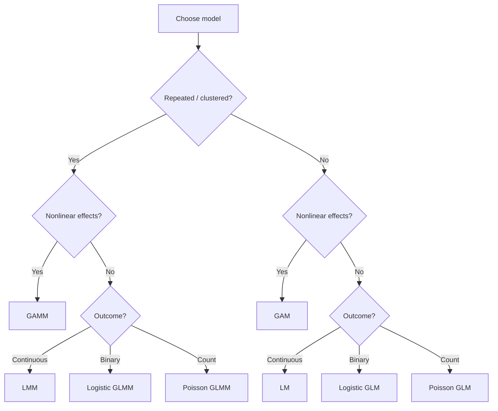

---
{"topic":"Math, Statistics, Modeling","dg-publish":true,"permalink":"/LearningNotes/Regression/","dgPassFrontmatter":true,"noteIcon":"","dg-note-properties":{"topic":"Math, Statistics, Modeling"}}
---

>[!abstract] Summary

>[!info] Related Notes

# Regression Models Taxonomy
## Understanding Regression Model Family

Regression models can be viewed as combinations of three independent dimensions:
- **Response distribution**
   - Gaussian (continuous)
   - Binomial (binary)
   - Poisson (counts)
   - Gamma, etc.
- **Functional form**
   - Linear
   - Nonlinear (e.g., splines)
- **Data structure**
   - Independent observations
   - Correlated observations (repeated measures, clustered data)

## Regression Model Family

| Model                                       | Response distribution  | Functional Form | Random Effects | Core Formula                              | Typical Use                                   |
| ------------------------------------------- | ---------------------- | --------------- | -------------- | ----------------------------------------- | --------------------------------------------- |
| **Linear Model (LM)**                       | Gaussian               | Linear          | ❌              | $Y = X\beta + \varepsilon$                | Standard linear regression                    |
| **[[LearningNotes/Generalized Linear Model\|Generalized Linear Model]] (GLM)**      | Any exponential family | Linear          | ❌              | $g(\mu) = X\beta$                         | Logistic, Poisson, Gamma regression           |
| **Generalized Additive Model (GAM)**        | Gaussian (or others)   | Nonlinear       | ❌              | $g(\mu) = \beta_0 + \sum_j f_j(X_j)$      | Flexible nonlinear effects                    |
| **[[LearningNotes/Linear Mixed Model\|Linear Mixed Model]] (LMM)**            | Gaussian               | Linear          | ✅              | $Y = X\beta + Zb + \varepsilon$           | Continuous longitudinal / hierarchical data   |
| **Generalized Linear Mixed Model (GLMM)**   | Non-Gaussian           | Linear          | ✅              | $g(\mu) = X\beta + Zb$                    | Binary or count longitudinal data             |
| **Generalized Additive Mixed Model (GAMM)** | Any                    | Nonlinear       | ✅              | $g(\mu) = \beta_0 + \sum_j f_j(X_j) + Zb$ | Longitudinal data with nonlinear trajectories |
>[!Note] For formulas:
> - $X\beta$ = fixed effects
> - $Zb$ = random effects
> - $g(⋅)$ = link function (identity, logit, log, ...)
> - $f(⋅)$ = smooth function (typically splines)
​

## Relationship Between Models
### LM -> GLM
GLM extends LM by allowing **non-Gaussian responses**.

### GLM -> GAM
GAM extends GLM by replacing linear terms with *smooth functions*: instead of $\beta \times X$, use $f(X)$

### LM -> LMM
LMM extends LM by adding *random effects*.

### GLM + LMM -> GLMM
GLMM = GLM + Random Effects ("mixed")

### GAM + LMM -> GAMM
GAMM = GAM + Random Effects ("mixed")

## Rule of Thumb

# Regression Methods and Extensions

## Core regression models by outcome type
### Linear Regression
- Prerequisites
	- linearity 
	- homoscedasticity
	- approximately normally distributed residuals/errors, for classical inference
	- independence of errors
	- no perfect multicollinearity; avoid severe multicollinearity
- see [[LearningNotes/Generalized Linear Model#Linear Regression as a GLM\|Generalized Linear Model#Linear Regression as a GLM]]
### Logistic Regression
- see [[LearningNotes/Generalized Linear Model#Logistic Regression as a GLM\|Generalized Linear Model#Logistic Regression as a GLM]]
### Poisson Regression
- see [[LearningNotes/Generalized Linear Model#Poisson Regression as a GLM\|Generalized Linear Model#Poisson Regression as a GLM]]
## Regression with transformed predictors
### Principal Component Regression
> [Source](https://towardsdatascience.com/principal-component-regression-clearly-explained-and-implemented-608471530a2f)
1. apply PCA ([[LearningNotes/Dimensionality Reduction#Principal Component Analysis (PCA)\|Dimensionality Reduction#Principal Component Analysis (PCA)]]) to generate principal components from the predictor variables, with the number of principal components matching the number of original features p
2. keep the first k principal components that explain most of the variance (where k < p), where k is determined by cross-validation
3. fit a linear regression model on these k principal components
### Partial Least Squares Regression
- useful when predictors are many and/or highly collinear, and the response can be single or multiple
- similar to [[LearningNotes/Regression#Principal Component Regression\|Regression#Principal Component Regression]], but it finds components that explain covariance between predictors and response(s)
## Regularized regression
Regularized regression adds a penalty ([[LearningNotes/Regularization\|Regularization]]) term to the loss function to control model complexity and reduce overfitting ([[LearningNotes/Cost Functions#Cost function with regularization\|Cost Functions#Cost function with regularization]]) .
### Lasso Regression
- uses [[LearningNotes/Regularization#L1/Lasso regularization\|Regularization#L1/Lasso regularization]]: shrink some coefficients exactly to zero, so it can perform feature selection.
### Ridge Regression
- uses [[LearningNotes/Regularization#L2/Ridge regularization\|Regularization#L2/Ridge regularization]]: shrinks coefficients toward zero but usually keeps all predictors
### Elastic Net 
- combines L1 and L2 penalties: [[LearningNotes/Regularization#Elastic Net\|Regularization#Elastic Net]]

# Regression Diagnostics

## Linear regression diagnostics
### residuals vs fitted
### Q-Q plot
### scale-location plot
### leverage / Cook's distance
### multicollinearity / VIF
### R-Squared: coefficient of determination
$$
R^2 = 1 - \frac{residual\  sum\  of\  squares\  (RSS)}{total\  sum\  of\  squares\  (TSS)}
= 1 - \frac{\sum{(y_i - \hat{y_i})^2}}{\sum{(y_i - \overline{y})^2}}
$$

- It assesses the goodness of fit of regression models.
- It represents the proportion of the variance for a dependent variable that's explained by an independent variable or variables in a regression model.
- It can be negative in extreme cases, but usually it is in $[0, 1]$.

You can regard the R-Squared as how much the total variance of y is captured by the model (rather than errors), i.e.
$$
var(y) = var(X\hat \beta) + var(e)
$$

$$
R^2 = \frac{var(X \hat\beta)}{var(y)}
$$

so it measures the goodness of fit, but it does not validate the model.

### Adjusted R-Squared
Adjusted R-squared is a **modified version of R-squared** that has been adjusted for the number of predictors in the model.

$$
Adj\ R^2 = 1 - (1 - R^2) \frac{n-1}{n-p-1} 
$$
where $p$ is the number of regressors/predictors, $n$ is the sample size.
> [!Tip] Why you need adjusted R-squared?
> It is important, because adding independent variables will make the R-squared never decrease, then you cannot tell whether the increase of R-squared is due to the goodness of fit or more variables.
> It includes the penalising factor that penalises you for adding independent variables that don't help your model.

## GLM and classification diagnostics
- deviance / AIC: see [[LearningNotes/Goodness of Fit\|LearningNotes/Goodness of Fit]]
- classification metrics: see [[LearningNotes/Confusion Matrix\|LearningNotes/Confusion Matrix]]
- ROC-AUC: see [[LearningNotes/Confusion Matrix#Receiver Operating Characteristic (ROC) & AUC\|LearningNotes/Confusion Matrix#Receiver Operating Characteristic (ROC) & AUC]]

